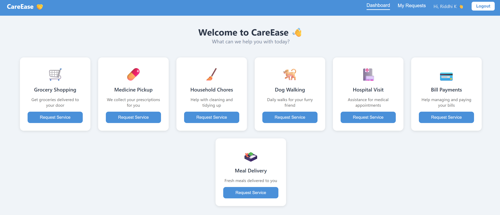
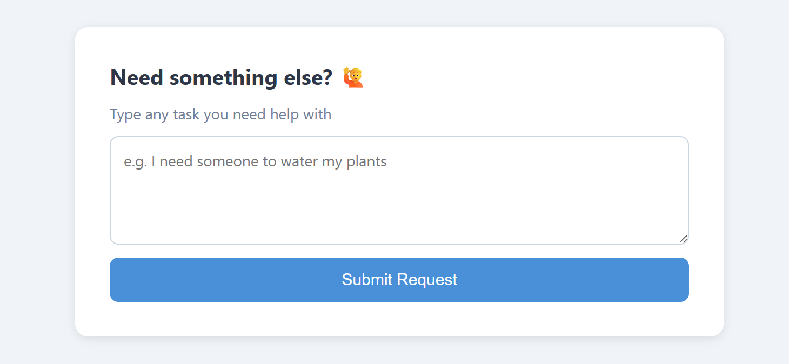

CareEase 🤝
A full-stack web application that helps elderly individuals request assistance for everyday tasks — from grocery shopping and medicine pickup to custom requests like watering plants or fixing a leaky tap.
🌟 Features

## 🌟 Features
- **User Authentication** — Secure register and login with JWT tokens and bcrypt password hashing  
- **Service Dashboard** — Browse 7 predefined services displayed as clean, interactive cards  
- **One-Click Requests** — Submit a service request instantly with a single button click  
- **Custom Requests** — Describe any task in your own words and submit it just like a regular service  
- **My Requests Page** — View all your submitted requests with live status badges  
- **Request Status Tracking** — Every request is tracked as **Pending, Accepted, or Completed**  
- **Online Payment Integration** — Integrated **Razorpay** for secure online payments through **UPI, cards, and net banking**  
- **Flexible Payment Options** — Users can either **Pay Now** while booking a service or choose **Pay After Service** for more convenience  
- **Responsive Design** — Works cleanly on both desktop and mobile  

## 🛠️ Tech Stack

### Frontend
- React.js
- React Router DOM
- Fetch API

### Backend
- Node.js
- Express.js
- MongoDB
- Mongoose
- JWT (jsonwebtoken)
- bcryptjs
- Razorpay API integration

📸 Screenshots

